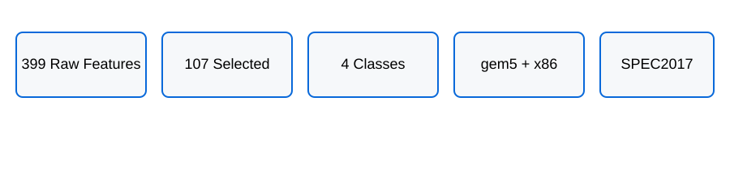
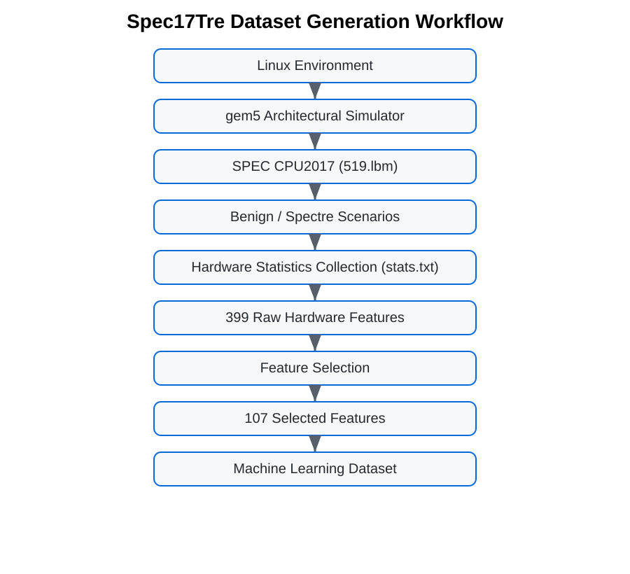

<p align="center">

</p>

# Spec17Tre
## A Benchmark Dataset for Hardware-Level Spectre Attack Detection Using gem5 Simulation

> **Spec17Tre** is an open benchmark dataset for detecting Spectre attacks using machine learning and deep learning from hardware-visible microarchitectural statistics collected with the **gem5** architectural simulator.

---

## Overview

Spec17Tre was developed to provide a reproducible benchmark dataset for hardware security research. Unlike many publicly available Spectre datasets that rely only on software-accessible Hardware Performance Counters (HPCs), Spec17Tre contains a rich set of hardware-visible statistics extracted directly from gem5 simulations.

The dataset was generated under Linux by executing the **SPEC CPU2017 519.lbm** benchmark in the gem5 simulator under both benign execution and Spectre attack scenarios.

The repository includes:

- Raw gem5 simulation outputs
- Processed datasets
- Machine-learning-ready feature tables
- Documentation
- Example scripts
- Reproducibility guide

---

# Why Spec17Tre?

Current Spectre datasets generally suffer from one or more of the following limitations:

| Existing datasets | Spec17Tre |
|-------------------|-----------|
| Limited hardware counters | 399 raw hardware statistics |
| Software-visible metrics | Hardware-visible gem5 statistics |
| Small feature space | 107 selected hardware features |
| Limited reproducibility | Raw simulation outputs included |
| Usually one architecture | In-Order + Out-of-Order architectures |
| Limited attack diversity | Multiple Spectre attack scenarios |

---

# Highlights

<p align="center">

</p>

- Linux-based simulation environment
- gem5 architectural simulator
- x86 ISA
- SPEC CPU2017 benchmark suite
- 519.lbm benchmark
- In-Order CPU architecture
- Out-of-Order CPU architecture
- Benign execution traces
- Spectre Variant-1 attack scenarios
- 399 original hardware metrics
- 107 processed hardware features
- Machine-learning-ready dataset
- Deep-learning-ready dataset
- Reproducible benchmark

---

# Scientific Background

Modern processors improve performance through speculative execution, branch prediction, out-of-order execution and cache hierarchies. These optimizations increase throughput but also introduce transient execution vulnerabilities.

Spectre exploits speculative execution to access sensitive information through cache side channels. Detecting these attacks using hardware-level observations is an active research area.

Spec17Tre provides a reproducible benchmark for this purpose.

---

# Experimental Environment

| Item | Description |
|------|-------------|
| Operating System | Linux |
| Simulator | gem5 |
| ISA | x86 |
| Simulation Mode | SE Mode |
| Benchmark | SPEC CPU2017 |
| Application | 519.lbm |
| CPU Architectures | In-Order and Out-of-Order |
| Attack Type | Spectre Variant-1 (three scenarios) |

---

# Dataset Versions

## Original Spec17Tre

- 79 samples
- 399 raw features
- 107 processed features

Class distribution

| Class | Samples |
|-------|---------|
| Benign | 20 |
| Spectre Scenario-1 | 19 |
| Spectre Scenario-2 | 20 |
| Spectre Scenario-3 | 20 |

The processed dataset was created through feature selection.

---

# Dataset Generation Workflow

<p align="center">

</p>

```text
Linux
    │
    ▼
gem5 Simulator
    │
    ▼
SPEC CPU2017
    │
    ▼
519.lbm
    │
    ▼
Benign / Spectre
    │
    ▼
stats.txt
    │
    ▼
Feature Extraction
    │
    ▼
399 Hardware Features
    │
    ▼
Feature Selection
    │
    ▼
107 Features
    │
    ▼
Spec17Tre
```

---

# Repository Structure


```text
Spec17Tre/
├── data/
│   ├── raw/
│   └── processed/
├── documentation/
├── examples/
├── scripts/
├── images/
├── README.md
├── LICENSE
├── CITATION.cff
└── zenodo.json
```

---

# Applications

The dataset can be used for:

- Hardware security
- Spectre attack detection
- Machine learning
- Deep learning
- Explainable AI
- Feature selection
- Processor architecture
- Cache side-channel analysis

---

# Citation

If you use this dataset, please cite the accompanying publication:

Hatice Aktas-Aydin, Gulay Yalcin

**Spec17Tre: A New Dataset in Hardware Security and Using Deep Learning for Detecting Spectre Attacks**

Arabian Journal for Science and Engineering, 2025.

---

# License

The Spec17Tre dataset is licensed under the
Creative Commons Attribution 4.0 International (CC BY 4.0).


---

# Future Work

Future releases are planned to include:

- Additional SPEC CPU2017 benchmarks
- More Spectre variants
- Larger datasets
- Additional processor architectures
- Automated dataset generation scripts

---

# Contact

**Hatice Aktas-Aydin**

Department of Computer Engineering

Sivas University of Science and Technology

Türkiye

Repository metadata updated. 
